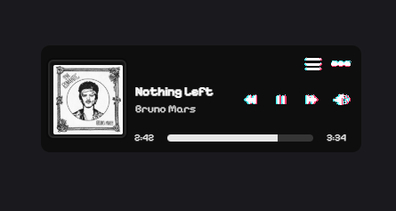

# Mini Box - Spotify Mini Player

Hello! MiniBox is a simple tiny, draggable Spotify mini player for Windows that stays on top of your other applications. In this ReadMe I'll provide a description of what the app is and you can check it out yourself by downloading it. (Linux in development!)

## Download

**[Download Latest Release](../../releases/latest)**

**Security Note:** Only download from the [official releases](../../releases/latest) on this repository. Always verify the repository URL before installation.

## Screenshots

## Features

These are the features of the app:

- Lightweight and minimal UI  
- Control playback from your desktop  
- Always-on-top window  
- Transparent draggable interface
- Theme system preference 
- Secure Spotify authentication

## Requirements

- Windows 10 or later
- **Spotify Premium account** (required for the app owner)
- Internet connection

## Installation

1. Download the latest `.exe` file from [Releases](../../releases/latest)
2. Run the installer and follow the prompts
3. Launch Mini Box from your Start Menu
4. Log in with your Spotify account on the popup
5. Enjoy your mini player!

## Usage

- **Drag the window** to move it around your screen
- **Play/Pause** - Click the play button
- **Skip songs** - Use next/previous buttons
- **Volume control** - Adjust your playback volume
- **Queue Window** - Click the queue button to see the current song and the next 2 upcoming songs
- **Next Song Preview** - A message appears 15 seconds before the current song ends showing what's playing next
- **Minimize** - Window stays on top of other apps

## Troubleshooting

**"Login failed"**
- Make sure you have an active internet connection
- Try restarting the app

**"No music playing"**
- Make sure Spotify is running on another device or browser

## License

ISC

---

Made with ❤️ for Spotify lovers
